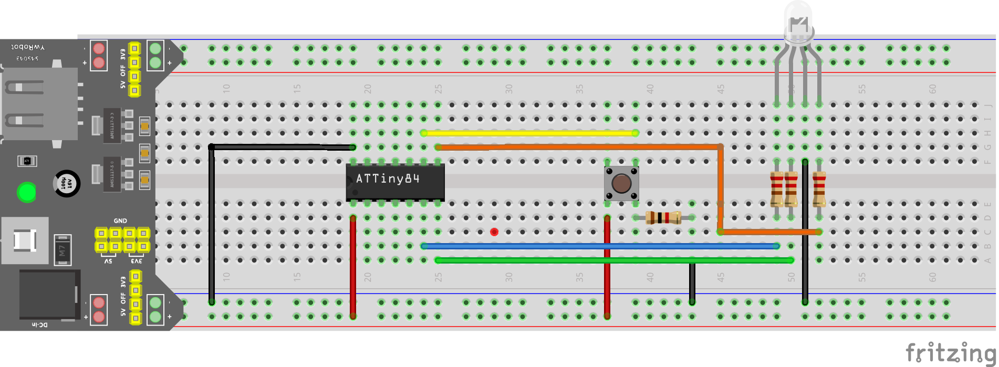

# veilleuse-rgb
une veilleuse RVB avec deux modes pour le parcours des couleurs

Voici le code d'une veuilleuse avec deux modes d'affichage:
 - un mode qui illumine à partir d'une couleur primaire et progressivement se décline vers une autre couleur primaire.
 - un mode dont la luminosité croit et décroit pour donner un effet "battement de coeur" sur chaque couelur primaire l'une après l'autre.
 
Le projet est assez simple et a été fait à partir d'n ATTINY84 (mais un attiny85 aurait suffit). L'alimentation est faite en 3.3V.
Voici le schéma de montage :

